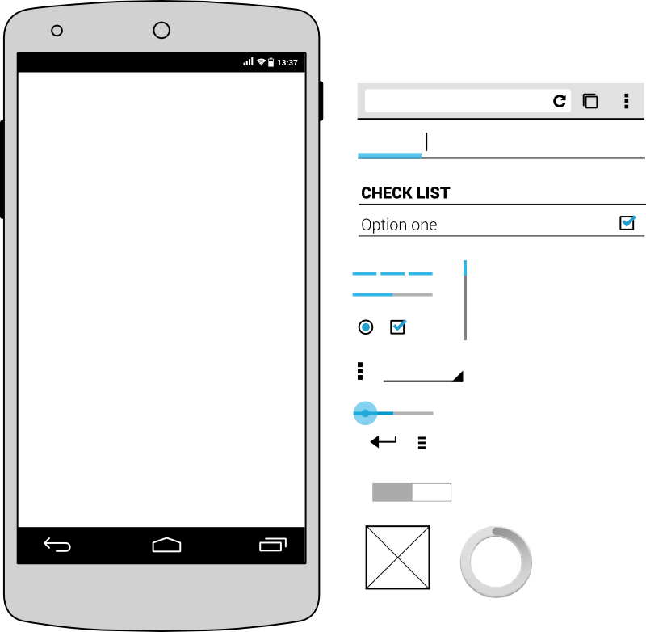

An attempt to provide a basic wireframe toolkit for Android.

It is meant to be used with Inkscape (SVG format).

Credits
-------

Inspired by :

* http://www.slideshare.net/kattekrab/inkscape-for-web-and-ui-mockups
* https://github.com/ajashton/Inkscape-Mockup-Toolkit
* https://github.com/blakeperdue/ios7-wireframe-kit

Resources from :

* http://wireframesketcher.com/mockups/android-kitkat.html
* http://developer.android.com/design/style/typography.html
* http://linuxdesigner.com/android/android-svg-icon-pack/

Authors
-------

